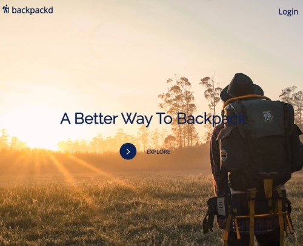
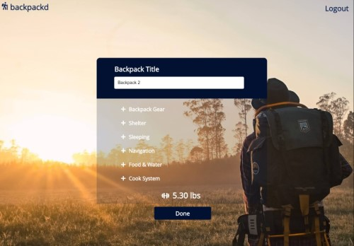

## Name

backpackd-server

## App

https://backpackd.now.sh/

## Client Repo

https://github.com/mmbmf1/backpackd-app

## Summary

The backpackd-server serves the backpackd-app for users to create and edit backpacks and their weights.

## Endpoint Breakdown

/api/backpacks - The backpacks endpoint returns all backpacks. Also accpets required inputs to post a new backpack.

/api/backpacks/:backpack_id - returns backpacks with the input id. This endpoint is used to patch and delete

/api/backpacks/:user_name - returns the backpacks for the logged in user.

/api/auth - the auth endpoint verifies the user's login credentials

/api/users - The endpoint to post a new user account

## Tech

Express.js
Node.js
PostgeSQL

## Landing Page:

## Backpacks Page:

## Add Backpacks Page:

## Edit Backpacks Page:

